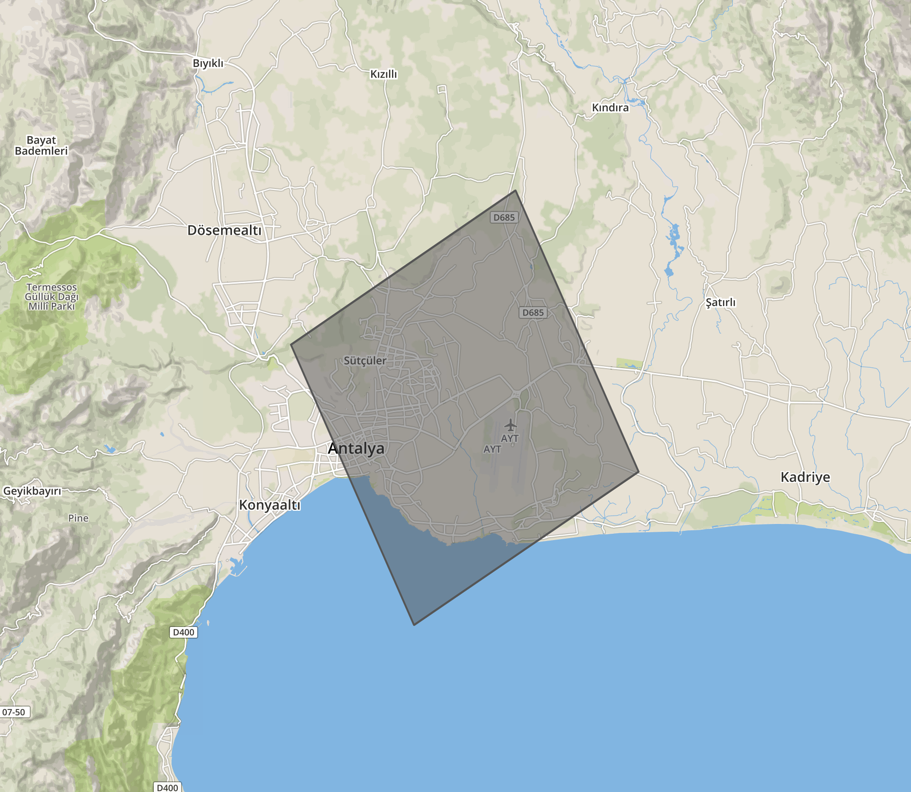

# Authentication
> --header **'apikey'**: **_'your_secret_apikey'_**

Authentication is done via request's header. **_"apikey"_** parameter should be 
given at **header**. Apikeys has daily or monthly or yearly limits and they 
may not open every product in tarla API.

**Base URL:** http://world.tarla.in/v3

# Drought

Drought service returns drought information of given location. 

|                    |                                                                                  |
|--------------------|----------------------------------------------------------------------------------|
| **Base URL**       | http://world.tarla.in/v3/drought                                                 |
| **Request Type**   | GET                                                                              |
| **Response Type**  | Instant response                                                                 |
| **Sample Request** | http://world.tarla.in/v3/drought?**lat**=39&**lng**=32&**month**=2&**year**=2018 |

**Explenation of request parameters:**

| Parameter | Type    | Explenation                          |
|-----------|---------|--------------------------------------|
| **lat**   | Float   | Latitude                             |
| **lng**   | Float   | Longitude                            |
| **month** | Integer | Integer value of month. Between 1-12 |
| **year**  | Integer | Integer value of year. Ex: 2019      |

<aside class="notice">
You can test this route from our swagger.
</aside>
[**Swagger for drought**](http://world.tarla.in/api/docs#!/Drought/get_drought)

## **Explenation of response body parameters:**

> Successful response body

```json
{
  "drought": {
      "few_drought_possibility": 9.13,
      "moderate_drought_possibility": 5.06,
      "pdsi": -2.396,
      "pdsiInfo": "Orta Kurak",
      "severe_drought_possibility": 2.48,
      "spei12": -0.729,
      "spei12Info": "Hafif Kurak",
      "spei9": -0.8,
      "spei9Info": "Orta Kurak",
      "spi12": -0.148,
      "spi12Info": "Normal",
      "spi6": -0.461,
      "spi6Info": "Normal",
      "total_drought_possibility": 16.67
  }
}

```

<aside class="success">
Successful response of drought request.
</aside>

| Parameter                        | Type   | Explenation                                   |
|----------------------------------|--------|-----------------------------------------------|
| **few_drought_possibility**      | Float  | Unit: Percentage %                            |
| **moderate_drought_possibility** | Float  | Unit: Percentage %                            |
| **pdsi**                         | Float  | Palmer drought index. Between -6 and 6        |
| **pdsiInfo**                     | String | Explenation of palmer drought index           |
| **severe_drought_possibility**   | Float  | Unit: Percentage %                            |
| **spei12**                       | Float  | 12 month spei drought index. Between -3 and 3 |
| **spei12Info**                   | String | Explenation spei12                            |
| **spei9**                        | Float  | 9 month spei drought index. Between -3 and 3  |
| **spei9Info**                    | String | Explenation spei9                             |
| **spi12**                        | Float  | 12 month spi drought index. Between -3 and 3  |
| **spi12Info**                    | String | Explenation spi12                             |
| **spi6**                         | Float  | 6 month spi drought index. Between -3 and 3   |
| **spi6Info**                     | String | Explenation spi6                              |
| **total_drought_possibility**    | Float  | Explenation of palmer drought index           |

## PDSI, SPEI, SPI Tables

**Table of PDSI Values**


**Table of SPEI Values**


**Table of SPI Values**


# Risk

Risk service returns all long term risk parameters (weather and lightning) 
for a location. Risk result is returned by grid base. We have 12x12 km grids.
Therefore, returning result belongs to the grid of your coordinate. Lets say your 
location is Antalya Airport then returning result belons to grid that includes 
Antalya Airport. Number of ligtnings, polygons means that they are happened inside this grid polygon area.  <br/>
You can see a grid example at belove image: <br/>




|                    |                                                                                  |
|--------------------|----------------------------------------------------------------------------------|
| **Base URL**       | http://world.tarla.in/v3/risk                                                    |
| **Request Type**   | GET                                                                              |
| **Response Type**  | Instant response                                                                 |
| **Sample Request** | http://world.tarla.in/v3/risk?**lat**=39&**lng**=32                              |

**Explenation of request parameters:**

| Parameter | Type    | Explenation                          |
|-----------|---------|--------------------------------------|
| **lat**   | Float   | Latitude                             |
| **lng**   | Float   | Longitude                            |

<aside class="notice">
You can test this route from our swagger.
</aside>
[**Swagger for risk**](http://world.tarla.in/api/docs#!/Risk/get_risk)

## **Explenation of response body parameters:**

> Successful response body

```json
{
  "lat": 39,
  "lng": 32,
  "start_date": "20160501",
  "end_date": "20190315",
  "total_day": 1048,
  "cg_count": 745,
  "ic_count": 215,
  "lightning_risk_count": 4,
  "lightning_risk_count_percent": 0.38,
  "total_precipitation": 852.0,
  "yearly_precipitation": {
          "2016": 134.9,
          "2017": 320.5,
          "2018": 315.0,
          "2019": 81.6
  },
  "total_precip_days": 243,
  "mean_precip_per_day": 0.81,
  "max_precip_day": {
         "value": 19.1,
         "day": "20180329"
  },
  "max_precip_month": {
         "value": 178.2,
         "month": "January"
  },
  "precipitation_90": 6.49,
  "concecutive_precip": 6,
  "concecutive_drought": 105,
  "mean_wind_per_day": 16.63,
  "wind_90": 31.97,
  "max_temp_90": 34.28,
  "max_temp_10": 1.76,
  "min_temp_90": 18.92,
  "min_temp_10": -6.71,
  "max_temp_day": {
        "value": 39.0,
        "day": "20170703"
  },
  "min_temp_day": {
        "value": -14.0,
        "day": "20171228"
  },
  "humudity_90": 84.15,
  "total_gdd_acc": 5639.0,
  "total_dsv_acc": 14.0,
  "total_sun_acc": 7390.0,
  "total_evapotrans_acc": 921.6,
  "long_term_monthly_precipitation": [
    {
      "month": 4,
      "year": 2018,
      "precipication": 45.5162
    },
    {
      "month": 5,
      "year": 2018,
      "precipication": 27.5539
    },
    {
      "month": 6,
      "year": 2018,
      "precipication": 8.1739
    },
    {
      "month": 7,
      "year": 2018,
      "precipication": 2.3142
    },
    {
      "month": 8,
      "year": 2018,
      "precipication": 2.1591
    },
    {
      "month": 9,
      "year": 2018,
      "precipication": 13.4742
    },
    {
      "month": 10,
      "year": 2018,
      "precipication": 48.2449
    },
    {
      "month": 11,
      "year": 2018,
      "precipication": 105.1477
    },
    {
      "month": 12,
      "year": 2018,
      "precipication": 145.3067
    },
    {
      "month": 1,
      "year": 2019,
      "precipication": 141.0835
    },
    {
      "month": 2,
      "year": 2019,
      "precipication": 105.6716
    },
    {
      "month": 3,
      "year": 2019,
      "precipication": 80.2739
    },
    {
      "month": 4,
      "year": 2019,
      "precipication": 45.5162
    }
  ],
  "monthly_risks": {
    "January": {
      "month_count": 3,
      "avarage_cg": 0.67,
      "avarage_ic": 0.33,
      "low_polygon": 0,
      "medium_polygon": 0,
      "high_polygon": 0,
      "precipitation": 178.2,
      "gdd": 36,
      "dsv": 0,
      "sun_acc": 860.0,
      "evapotrans_acc": 80.8
    },
    "February": {
      "month_count": 3,
      "avarage_cg": 0.67,
      "avarage_ic": 0.33,
      "low_polygon": 0,
      "medium_polygon": 0,
      "high_polygon": 0,
      "precipitation": 178.2,
      "gdd": 36,
      "dsv": 0,
      "sun_acc": 860.0,
      "evapotrans_acc": 80.8
    },
    "March": {
      "month_count": 3,
      "avarage_cg": 0.67,
      "avarage_ic": 0.33,
      "low_polygon": 0,
      "medium_polygon": 0,
      "high_polygon": 0,
      "precipitation": 178.2,
      "gdd": 36,
      "dsv": 0,
      "sun_acc": 860.0,
      "evapotrans_acc": 80.8
    },
    "April": {
      "month_count": 3,
      "avarage_cg": 0.67,
      "avarage_ic": 0.33,
      "low_polygon": 0,
      "medium_polygon": 0,
      "high_polygon": 0,
      "precipitation": 178.2,
      "gdd": 36,
      "dsv": 0,
      "sun_acc": 860.0,
      "evapotrans_acc": 80.8
    },
    "May": {
      "month_count": 3,
      "avarage_cg": 0.67,
      "avarage_ic": 0.33,
      "low_polygon": 0,
      "medium_polygon": 0,
      "high_polygon": 0,
      "precipitation": 178.2,
      "gdd": 36,
      "dsv": 0,
      "sun_acc": 860.0,
      "evapotrans_acc": 80.8
    },
    "June": {
      "month_count": 3,
      "avarage_cg": 0.67,
      "avarage_ic": 0.33,
      "low_polygon": 0,
      "medium_polygon": 0,
      "high_polygon": 0,
      "precipitation": 178.2,
      "gdd": 36,
      "dsv": 0,
      "sun_acc": 860.0,
      "evapotrans_acc": 80.8
    },
    "July": {
      "month_count": 3,
      "avarage_cg": 0.67,
      "avarage_ic": 0.33,
      "low_polygon": 0,
      "medium_polygon": 0,
      "high_polygon": 0,
      "precipitation": 178.2,
      "gdd": 36,
      "dsv": 0,
      "sun_acc": 860.0,
      "evapotrans_acc": 80.8
    },
    "August": {
      "month_count": 3,
      "avarage_cg": 0.67,
      "avarage_ic": 0.33,
      "low_polygon": 0,
      "medium_polygon": 0,
      "high_polygon": 0,
      "precipitation": 178.2,
      "gdd": 36,
      "dsv": 0,
      "sun_acc": 860.0,
      "evapotrans_acc": 80.8
    },
    "September": {
      "month_count": 3,
      "avarage_cg": 0.67,
      "avarage_ic": 0.33,
      "low_polygon": 0,
      "medium_polygon": 0,
      "high_polygon": 0,
      "precipitation": 178.2,
      "gdd": 36,
      "dsv": 0,
      "sun_acc": 860.0,
      "evapotrans_acc": 80.8
    },
    "October": {
      "month_count": 3,
      "avarage_cg": 0.67,
      "avarage_ic": 0.33,
      "low_polygon": 0,
      "medium_polygon": 0,
      "high_polygon": 0,
      "precipitation": 178.2,
      "gdd": 36,
      "dsv": 0,
      "sun_acc": 860.0,
      "evapotrans_acc": 80.8
    },
    "November": {
      "month_count": 3,
      "avarage_cg": 0.67,
      "avarage_ic": 0.33,
      "low_polygon": 0,
      "medium_polygon": 0,
      "high_polygon": 0,
      "precipitation": 178.2,
      "gdd": 36,
      "dsv": 0,
      "sun_acc": 860.0,
      "evapotrans_acc": 80.8
    },
    "December": {
      "month_count": 3,
      "avarage_cg": 0.67,
      "avarage_ic": 0.33,
      "low_polygon": 0,
      "medium_polygon": 0,
      "high_polygon": 0,
      "precipitation": 178.2,
      "gdd": 36,
      "dsv": 0,
      "sun_acc": 860.0,
      "evapotrans_acc": 80.8
    },
  }
}
```

<aside class="success">
Successful response of risk request.
</aside>

**Parameter**|**Type**|**Explenation**
:-----|:-----:|:-----
**lat**|Float|Float
**lng**|Float|Float
**start_date**|String|Start date of calculation of returning risk parameters.
**end_date**|String|End date of calculation of returning risk parameters.
**total_day**|Integer|Indicates that for how many days these risk parameters are calculated. (end_date - start_date)
**cg_count**|Integer|Total cloud to ground lightning count in the 12x12km grid. 
**ic_count**|Integer|Total inter cloud lightning count in the 12x12km grid.
**lightning_risk_count**|Integer|Number of risky days that can happen hail etc. Number of days that have cg/ic < 0.1
**lightning_risk_count_percent**|Float|Percentage of lightning risks in total days
**total_precipitation**|Float|Total precipitation. Unit milimeter.
**yearly_precipitation**|JSON|Total precipitation for each year in given time interval. Unit milimeter. 
**total_precip_days**|Integer|How many days are passed with precipitation in given time interval. 
**mean_precip_per_day**|Float|Average precipitation for one day in given time interval.
**max_precip_day**|JSON|Indicates the day that has maximum precipitation for given time interval.
**max_precip_month**|JSON|Indicates the month that has maximum precipitation for given time interval.
**precipitation_90**|Float|Extreme precipitation average that aboves 90 percentage when values are sorted in ascending order. 
**concecutive_precip**|Integer|Indicates how many consecutive 5 days precipitation happened.
**concecutive_drought**|Integer|Indicates how many consecutive 5 days drougth(no precipitation) happened. 
**mean_wind_per_day**|Float|Average wind speed for one day in given time interval. Unit km/h
**wind_90**|Float|Extreme wind speed average that aboves 90 percentage when values are sorted in ascending order. 
**max_temp_90**|Float|Extreme maximum temperature average that aboves 90 percentage when values are sorted in ascending order. 
**max_temp_10**|Float|Extreme maximum temperature average that beloves 10 percentage when values are sorted in ascending order.
**min_temp_90**|Float|Extreme minimum temperature average that aboves 90 percentage when values are sorted in ascending order. 
**min_temp_10**|Float|Extreme minimum temperature average that beloves 10 percentage when values are sorted in ascending order. 
**max_temp_day**|JSON|Indicates the day that has maximum temperature for given time interval 
**min_temp_day**|JSON|Indicates the day that has minimum temperature for given time interval 
**humudity_90**|Float|Extreme humudity average that aboves 90 percentage when values are sorted in ascending order. Unit percentage %
**total_gdd_acc**|Float|Temperature accumulation in given time interval. Unit celcius 
**total_dsv_acc**|Float|Disease risk accumulation in given time interval. Unitless 
**total_sun_acc**|Float|Sunshine time accumulation in given time interval. Unit hour 
**total_evapotrans_acc**|Float|Sweating evaporation accumulationin given time interval. Unit milimeter.
**long_term_monthly_precipitation**|JSON|Average precipitations are calculated from approximately 30 years of data. This parameter average precipitation of last 1 year.
**monthly_risks**|JSON|Risk parameters for months

<br/>
<br/>
**Explenation of _long_term_monthly_precipitation_ JSON:**

**Parameter**|**Type**|**Explenation**
:-----|:-----:|:-----
**month**|Integer|Integer value of month. Between 1-12
**year**|Integer|Integer value of year. Ex: 2019
**precipitation**|Float|Average precipitation for this date calculated from ~30 years of data.

<br/>
<br/>
**Explenation of _monthly_risks_ JSON:**

**Parameter**|**Type**|**Explenation**
:-----|:-----:|:-----
**month_count**|Integer|Indicates how many month there are in given time interval
**avarage_cg**|Float|Average cloud to ground lightning that happened in this month.(in the 12x12km grid)
**avarage_ic**|Float|Average inter cloud lightning that happened in this month.(in the 12x12km grid)
**low_polygon**|Integer|Number of low(few) storm polygon that happened in this month.(in the 12x12km grid)
**medium_polygon**|Integer|Number of medium(moderate) storm polygon that happened in this month.(in the 12x12km grid)
**high_polygon**|Integer|Number of high(severe) storm polygon that happened in this month.(in the 12x12km grid)
**precipitation**|Float|Total precipitation in this month. Unit milimeter.
**gdd**|Float|Temperature accumulation in this month. Unit celcius
**dsv**|Float|Disease risk accumulation in this month. Unitless
**sun_acc**|Float|Sunshine accumulation in this month. Unit hour
**evapotrans_acc**|Float|Sweating evaporation accumulaiton in this month. Unit milimeter

<br/>
<br/>
<br/>

**Explenation of percentile:**


<br/>

**Explenation of consecutive precip,drought:**<br/>
Ardışık art arda 5 gün boyunca gerçekleşen yağışlı seriden, belirtilen tarihte toplam kaç tane olduğunu belirtir. Aşağıdaki array’de yağış miktarları ve kaç tane consecutive_precip olduğu örnek verilmiştir. 

Yağış Array’i: [0, 0, 1.2, 2.3, 0.5, 0, **1.3**, **1.5**, **2.5**, **3.1**, **2.6**, 4.2, 5.3, 0, 0, **1.2**, **3.1**, **4.2**, **5.3**, **1** ]  <br/>
Consecutive_precip: **2**

<br/>

**Explenation of month count:**<br/>
Verilen tarih aralığında aylardan kaç tane olduğu belirtilir aşağıda bir örneği verilmiştir. <br/>
start_date: **20180301** <br/>
end_date: **20190530**

Örneğin yukarıdaki 15 aylık zaman aralığında 12 aydan birer tane ve ekstra olarak **Mart, Nisan ve Mayıs**’tan 2 şer tane bulunmaktadır. Hem 2018 mart
 hem de 2019 mart gibi. Dolayısıyla **Mart, Nisan ve Mayıs** için **month_count** 2’dir. Diğer aylar için 1’dir. 

# Nowcast

Nowcast service sends you an alert for lightning, precipitation or storm polygon events. <br/> <br/>
This URL is for adding user to nowcast service. When an alert is happened in user's locaiton, 
we POST a JSON to URL that you specified when adding the user. We send all users in once **not** one by one. 
If no alert alert is happened in any of your user's location, we do not POST anything. <br/>
Therefore, to use this service, you need an API that accepts our POST requests. 
Then you put URL of your API when you are adding new user under **post_url** parameter. <br/>

Nowcast service checks all places approximately in every 6 minutes. If it detects any lightning, precipitation or storm polygon it sends alerts.
When an alert is sended to the user, 1 hour sleep time begins. It means that we do not send same alert type for that user for 1 hour. Lets say system send a lightning alert to user X.
Then it does not send any lightning alert for that user for 1 hour. However, if precipitation alert is happened in user X's location, system sends it. 


|                    |                                                                                  |
|--------------------|----------------------------------------------------------------------------------|
| **Base URL**       | http://world.tarla.in/v3/nowcast                                                 |
| **Request Type**   | POST                                                                             |
| **Request Heeader**| application/json                                                                 |
| **Response Type**  | Instant response                                                                 |

```json
{
 "lat": 39.0,
 "lng": 32.0,
 "post_url": "http://sample-backend.com/nowcast",
 "user_id": "sample_user_id",
 "is_lightning": true,
 "is_polygon": true,
 "is_precipitation": false
}
```


**Parameter**|**Type**|**Explenation**
:-----|:-----:|:-----
**lat**|Float|Latitude of user's coordinate. 
**lng**|Float|Longitude of user's coordinate. 
**post_url**|String|It is the POST URL when an alert happens in user's location. (You need to give same POST URL for all of your users. In this way, we can send all users that has alerts to your URL in once.)
**user_id**|String|Unique id of the user in your system. 
**is_lightning**|Boolean|It indicates that whether lightning alert will be send to this user or not.
**is_polygon**|Boolean|It indicates that whether storm polygon alert will be send to this user or not.
**is_precipitation**|Boolean|It indicates that whether precipitation alert will be send to this user or not.

```json
{
  "message":"Created"
}
```
<aside class="success">
Successful response of drought request.
</aside>

<aside class="notice">
You can test this route from our swagger.
</aside>
[**Swagger for nowcast**](http://world.tarla.in/api/docs#!/Nowcast/post_nowcast_user)


## **Explenation of alert POST body parameters:**

This is explenation of a sample alert POST reqeust to your API.<br/>
<aside class="notice">
We guarantee that at least one of **lightning**,**polygon** or **precipitation** lists will be filled. 
For example if lightning and polygon lists are empty than we know that precipitation list is filled.
</aside>

```json
{
  "lightning": [
    {
      "user": "sample_user_id"
    },
    {
      "user": "sample_user_id"
    }
  ],
  "polygon": [
    {
      "user": "sample_user_id",
      "severity": "High"
    },

    {
      "user": "sample_user_id",
      "severity": "Medium"
    }
  ],
  "precipitation": [
    {
      "user": "sample_user_id",
      "direction": "north",
      "arrival_time": 23
    },
    {
      "user": "sample_user_id",
      "direction": "southeast",
      "arrival_time": 31
    }
  ]
}
```

**Parameter**|**Type**|**Explenation**
:-----|:-----:|:-----
**lightning**|JSON|It includes users that lightning events are happening in their location.
**user**|String|Unique id of the user that lightning event is happend in his location. 
**polygon**|JSON|It includes users that storm polygon events are happening in their location.
**severity**|String|Severity of the storm polygon. It can be **"High", "Medium" or "Low"**. 
**precipitation**|JSON|It includes users that precipitation events are happening in their location.
**direction**|String|Direction of the approaching precipitation. It can be **"north", "south", "west", "east", "northeast", "northwest", "southeast", "southwest"**
**arrival_time**|Integer|Approximate arrival time of the precipitation that is approaching to user's location. Unit: Minute

# Weather 

There is 2 route under **weather**. They are **month** and **forecast** routes. <br/>

**month:** It returns 14-day backward and 14-day forward weather information from starting beginning date. <br/>

**forecast:** It returns 14-day forward weather information from starting beginning date. 
<br/>

|                              |                                                                                  |
|------------------------------|----------------------------------------------------------------------------------|
| **Base URL(month)**          | http://world.tarla.in/v3/weather/month                                           |
| **Base URL(forecast)**       | http://world.tarla.in/v3/weather/forecast                                        |
| **Request Type**             | GET                                                                              |
| **Response Type**            | Instant response                                                                 |
| **Sample Request(month)**    | http://world.tarla.in/v3/weather/month?**lat**=39&**lng**=32                     |
| **Sample Request(forecast)** | http://world.tarla.in/v3/weather/forecast?**lat**=39&**lng**=32                  |

<aside class="notice">
You can test this route from our swagger.
</aside>
[**Swagger for weather(forecast)**](http://world.tarla.in/api/docs#!/Weather/get_weather_forecast) <br/>

[**Swagger for weather(month)**](http://world.tarla.in/api/docs#!/Weather/get_weather_month)

## **Explenation of response body parameters:**

> Successful response body

```json
{
  "weather": [
    {
      "dt": 20190310,
      "humidity": 58,
      "precipitation": 0.0,
      "precipitation_probability": 0,
      "temperature_max": 16.81,
      "temperature_min": 9.16,
      "winddirection": 270,
      "windspeed_max": 13.03,
      "icon": 2,
    },
    .
    .
    .
]}
```
<aside class="success">
Successful response of risk request.
</aside>

**Parameter**|**Type**|**Explenation**
:-----|:-----:|:-----
**dt**|Integer|Date in YYYYMMDD format. Ex: 20190315 
**humidity**|Integer|Unit: Percentage %
**precipitation**|Float|Unit: Milimeter 
**precipitation_probability**|Integer|Unit: Percentage %
**temperature_max**|Float|Maximum temperature for that day. Unit: Celcius 
**temperature_min**|Float|Minimum temperature for that day. Unit: Celcius
**winddirection**|Integer|Direction of the wind 0-360 degree. Explenation is belove. 
**windspeed_max**|Float|Maximum wind speed. Unit: km/h
**icon**|Integer|Weather icon number between 1-17. <br/> 1- Güneşli 2- Güneşli-Bulutlu 3- Parçalı Bulutlu 4- Kapalı 5- Sisli 6- Yağmurlu 7- Sağanak Yağışlı 8- Şimşekli-Yağmurlu 9- Karlı 10- Sağanak Karlı 11- Sulu kar 12- Yağmurlu 13- Hafif Karlı 14- Parçalı Yağmurlu 15- Rüzgarlı Karlı 16- Hafif Yağmurlu 17- Hafif Karlı

**Explenation of winddirection parameter:**


# Error Codes

**Code**|**Explenation**|**Return Value**
:-----|:-----|:-----
**403**|no permission to access|{ "message": "Forbidden"}
**500**|a problem occured about returning data|{ "message": "Error"}
**401**|there is no apikey parameter at header of the request|{ "message": "Auth API key required."}
**401**|wrong apikey|{ "message": "Invalid API key."}
**401**|apikey does not have permission to user that product|{ "message": "Wrong product."}
**401**|apikey run out of limit for that product|{ "message": API key exceeded."}
**401**|apikey expired|{ "message": API key expired."}
**422**|wrong parameters in the request|JSON that has what is wrong in your request 
